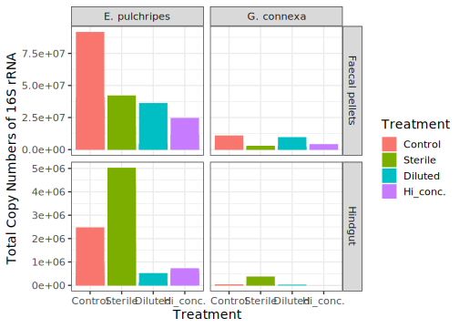
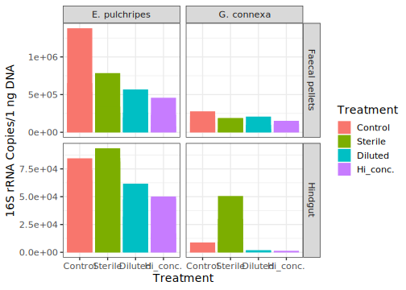
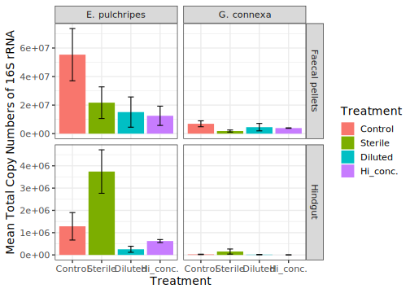
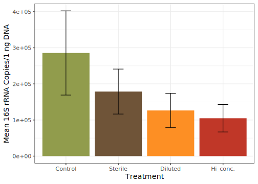
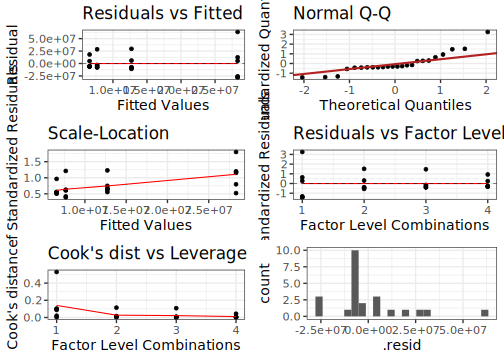
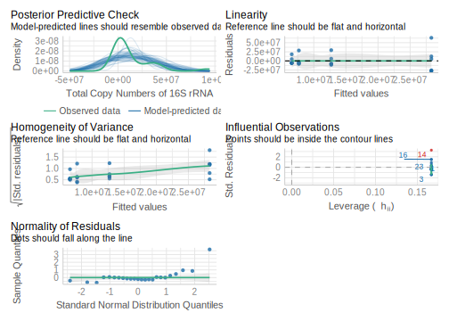
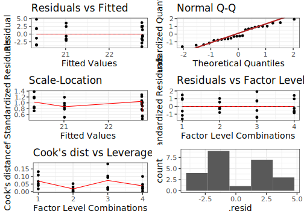
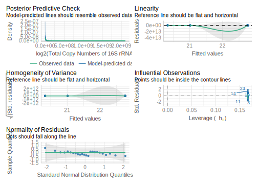

[julius.nweze@bc.cas.cz](mailto: julius.nweze@bc.cas.cz)  

## 16S Copy Number Analysis
Analysis of bacterial 16S rRNA copy numbers in response to antibiotics treatment.
Species tested: *E. pulchripes*

### *E. pulchripes* hindgut bacterial 16S copy analysis

```r
read_csv("9_ddPCR_Copy_Numbers.csv",
         trim_ws = TRUE,
         col_names = TRUE) %>% # read the csv file
  mutate_at(c("Code",
              "Treatment",
              "Replicate",
              "Individual"),
            ~ (factor(.))) %>% # convert to factor
     mutate(Treatment = fct_relevel(Treatment, "Control", "Sterile", "Diluted", "Hi_conc."))-> # arrange factor levels 4 plotting
  ddPCR_copies
```

*Barplot of E. pulchripes hindgut bacterial copy numbers for all replicates*

```r
# Barplot for all total copy numbers
ggplot(ddPCR_copies, aes(x = Treatment, y = `Total Copy Numbers of 16S rRNA`, fill = Treatment, group = Code)) + 
  geom_bar(stat = 'identity', position='dodge') +  xlab("Treatment") + scale_y_continuous(label=scientific) +
  facet_grid(`Sample type` ~ Species , scales = "free")
```

<!-- -->

```r
# Barplot for all 16S rRNA Copies/1 ng DNAs
ggplot(ddPCR_copies, aes(x = Treatment, y = `16S rRNA Copies/1 ng DNA`, fill = Treatment, group = Code)) + 
  geom_bar(stat = 'identity', position='dodge') +  xlab("Treatment") + scale_y_continuous(label=scientific) +
  facet_grid(`Sample type` ~ Species , scales = "free")
```

<!-- -->

*Barplot of E. pulchripes hindgut bacterial mean copy numbers**

```r
# Barplot for mean total copy numbers
 ddPCR_copies %>%  # the name of the new data frame and the data frame to be summarised
  drop_na() %>% # drop rows with missing values
  group_by(Species, Treatment, `Sample type`) %>%   # the grouping variable
  summarise(`Mean Total Copy Numbers of 16S rRNA` = mean(`Total Copy Numbers of 16S rRNA`),  # calculates the mean of each group
            StD = sd(`Total Copy Numbers of 16S rRNA`), # calculates the standard deviation of each group
            n = n(),  # calculates the sample size per group
            SE = sd(`Total Copy Numbers of 16S rRNA`)/sqrt(n())) -> # calculates the standard error of each group
 Total_mean

# Create plot
ggplot(Total_mean, aes(x = Treatment, y = `Mean Total Copy Numbers of 16S rRNA`)) + 
  geom_bar(stat = 'identity', position='dodge', aes(fill=Treatment)) +
  geom_errorbar(aes(ymin = `Mean Total Copy Numbers of 16S rRNA` - SE, ymax = `Mean Total Copy Numbers of 16S rRNA` + SE), width=.2,
                 position=position_dodge(.9)) + scale_y_continuous(label=scientific) +
  facet_grid(`Sample type` ~ Species , scales = "free")
```

<!-- -->

```r
 # fill = pom4, 

# Barplot for mean 16S rRNA Copies/1 ng DNA
ddPCR_copies %>%  # the name of the new data frame and the data frame to be summarised
  drop_na() %>% # drop rows with missing values
  group_by(Treatment) %>%   # the grouping variable
  summarise(`Mean 16S rRNA Copies/1 ng DNA` = mean(`16S rRNA Copies/1 ng DNA`),  # calculates the mean of each group
            StD = sd(`16S rRNA Copies/1 ng DNA`), # calculates the standard deviation of each group
            n = n(),  # calculates the sample size per group
            SE = sd(`16S rRNA Copies/1 ng DNA`)/sqrt(n())) -> # calculates the standard error of each group
  DNA_mean


# Create plot
ggplot(DNA_mean, aes(x = Treatment, y = `Mean 16S rRNA Copies/1 ng DNA`)) + 
  geom_bar(stat = 'identity', position='dodge', fill = pom4, aes(fill=Treatment)) +
  geom_errorbar(aes(ymin = `Mean 16S rRNA Copies/1 ng DNA` - SE, ymax = `Mean 16S rRNA Copies/1 ng DNA` + SE), width=.2,
                 position=position_dodge(.9)) + scale_y_continuous(label=scientific)
```

<!-- -->

#### Anova tests
**Compare Epibolus hindgut bacterial 16S copy numbers between groups**

```r
# ANOVA for total copy numbers
ddPCR_copies %>% 
  filter(Species == "E. pulchripes") %>% 
  aov(`Total Copy Numbers of 16S rRNA` ~ Treatment, .) -> # fit an anova model
  aov_total
  
print(Anova(aov_total)) # print results
```

```
## Anova Table (Type II tests)
## 
## Response: Total Copy Numbers of 16S rRNA
##               Sum Sq Df F value Pr(>F)
## Treatment 1.8086e+15  3  1.3236 0.2946
## Residuals 9.1095e+15 20
```

```r
aov_total_df <- fortify(aov_total) # make a data frame for plotting
factor.combinations <-
  as.numeric(factor(aov_total_df$Treatment),
             levels = unique(as.character(paste(aov_total_df$Treatment)))
  ) # needed for "residuals vs leverage
mod_data_df_total <-
  cbind(aov_total_df,
        rows = 1:nrow(aov_total_df),
        factors = factor.combinations)

PlotLmResid(mod_data_df_total) # plot residuals
```

<!-- -->

```r
check_model(aov_total)
```

<!-- -->

```r
emm_mod <- emmeans(aov_total, as.formula(paste("", "Treatment", sep = " ~ ")), weights = "equal")
# Contrasts, pairwise comparisons, tests, and confidence intervals.
emm_mod_cons <- contrast(emm_mod, method = "pairwise", adjust = "BH")
print(emm_mod_cons)
```

```
##  contrast           estimate       SE df t.ratio p.value
##  Control - Sterile  15589167 12321728 20   1.265  0.4407
##  Control - Diluted  20631000 12321728 20   1.674  0.3289
##  Control - Hi_conc. 21739167 12321728 20   1.764  0.3289
##  Sterile - Diluted   5041833 12321728 20   0.409  0.8241
##  Sterile - Hi_conc.  6150000 12321728 20   0.499  0.8241
##  Diluted - Hi_conc.  1108167 12321728 20   0.090  0.9292
## 
## P value adjustment: BH method for 6 tests
```

```r
ddPCR_copies %>% 
  filter(Species == "E. pulchripes") %>% 
  aov(log2(`Total Copy Numbers of 16S rRNA`) ~ Treatment, .) -> # fit an anova model
  aov_total_log
print(Anova(aov_total_log)) # print results
```

```
## Anova Table (Type II tests)
## 
## Response: log2(`Total Copy Numbers of 16S rRNA`)
##            Sum Sq Df F value Pr(>F)
## Treatment  27.621  3  1.2271 0.3259
## Residuals 150.066 20
```

```r
aov_total_log_df <- fortify(aov_total_log) # make a data frame for plotting
factor.combinations <-
  as.numeric(factor(aov_total_log_df$Treatment),
             levels = unique(as.character(paste(aov_total_log_df$Treatment)))
  ) # needed for "residuals vs leverage
mod_data_df_total_log <-
  cbind(aov_total_log_df,
        rows = 1:nrow(aov_total_log_df),
        factors = factor.combinations)

PlotLmResid(mod_data_df_total_log) # plot residuals
```

<!-- -->

```r
check_model(aov_total_log)
```

<!-- -->

```r
emm_mod <- emmeans(aov_total_log, as.formula(paste("", "Treatment", sep = " ~ ")), weights = "equal")
# Contrasts, pairwise comparisons, tests, and confidence intervals.
emm_mod_cons <- contrast(emm_mod, method = "pairwise", adjust = "BH")
print(emm_mod_cons)
```

```
##  contrast           estimate   SE df t.ratio p.value
##  Control - Sterile   -0.0145 1.58 20  -0.009  0.9928
##  Control - Diluted    2.4249 1.58 20   1.533  0.4226
##  Control - Hi_conc.   1.7415 1.58 20   1.101  0.4259
##  Sterile - Diluted    2.4394 1.58 20   1.542  0.4226
##  Sterile - Hi_conc.   1.7559 1.58 20   1.110  0.4259
##  Diluted - Hi_conc.  -0.6834 1.58 20  -0.432  0.8043
## 
## Results are given on the log2 (not the response) scale. 
## P value adjustment: BH method for 6 tests
```
1. The ANOVA model indicates a significant different in the total copy numbers.
2. The ANOVA model indicates a significant different in the 16S rRNA Copies/1 ng DNA.


**Post-hoc tests for E. pulchripes hindgut bacterial 16S copy numbers between groups**

```r
# Post-hoc tests for total copy numbers
TukeyHSD(aov_total) # Compute Tukey Honest Significant Differences
```

```
##   Tukey multiple comparisons of means
##     95% family-wise confidence level
## 
## Fit: aov(formula = `Total Copy Numbers of 16S rRNA` ~ Treatment, data = .)
## 
## $Treatment
##                       diff       lwr      upr     p adj
## Sterile-Control  -15589167 -50076897 18898564 0.5945200
## Diluted-Control  -20631000 -55118730 13856730 0.3624835
## Hi_conc.-Control -21739167 -56226897 12748564 0.3188199
## Diluted-Sterile   -5041833 -39529564 29445897 0.9762415
## Hi_conc.-Sterile  -6150000 -40637730 28337730 0.9583311
## Hi_conc.-Diluted  -1108167 -35595897 33379564 0.9997300
```
Pairs: 
1. There are significant differences between: 2X Diluted-Sterile and Undiluted-Sterile only in the total copy numbers.
2. There are significant differences between: Undiluted-Control, Undiluted-Sterile, and 2X Diluted-Sterile in the 16S rRNA Copies/1 ng DNA.
3. There are no significant differences in the 16S rRNA Copies/mg sample weight.
